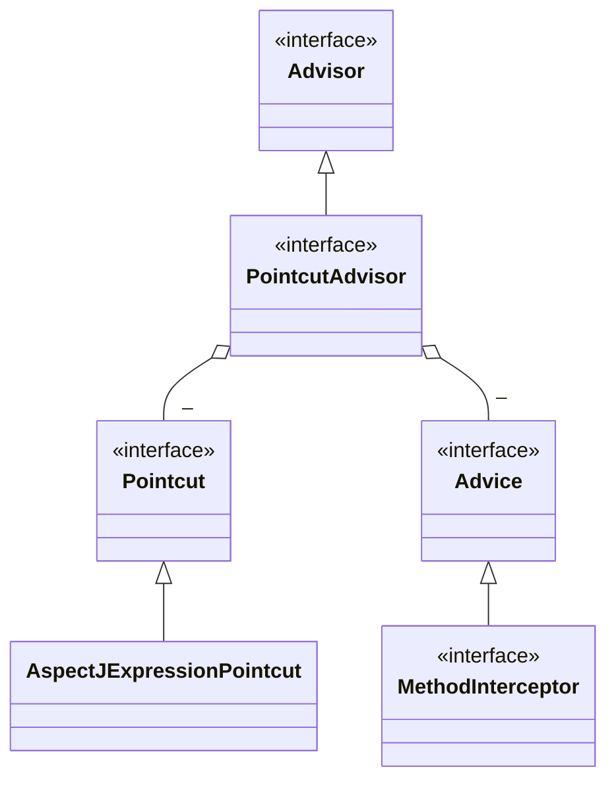
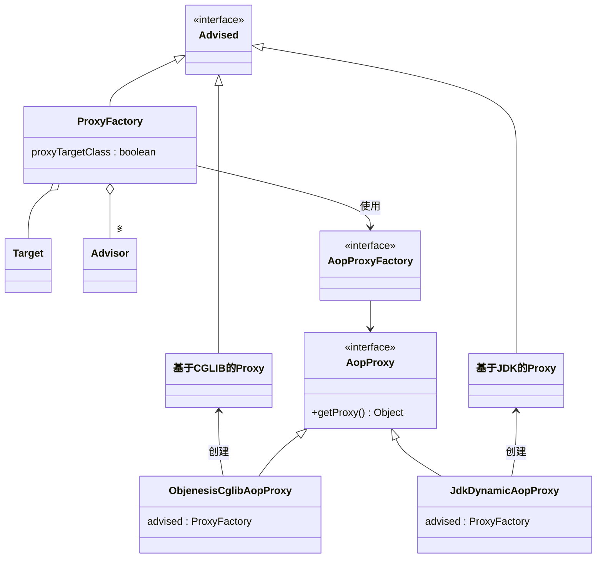
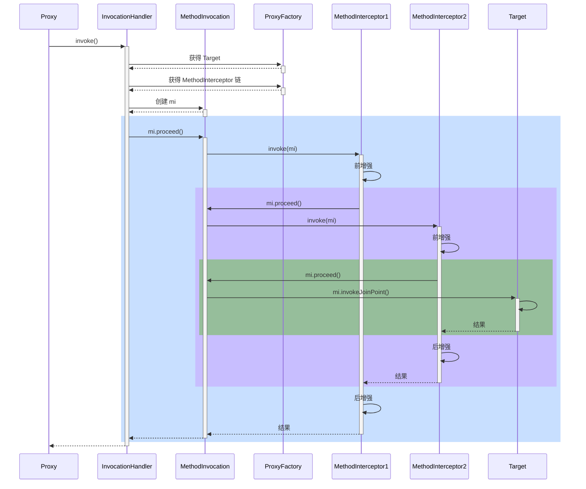

## AOP

AOP 底层实现方式之一是代理，由代理结合通知和目标，提供增强功能

除此以外，aspectj 提供了两种另外的 AOP 底层实现：

* 第一种是通过 ajc 编译器在**编译** class 类文件时，就把通知的增强功能，织入到目标类的字节码中

* 第二种是通过 agent 在**加载**目标类时，修改目标类的字节码，织入增强功能
* 作为对比，之前学习的代理是**运行**时生成新的字节码

简单比较的话：

* aspectj 在编译和加载时，修改目标字节码，性能较高
* aspectj 因为不用代理，能突破一些技术上的限制，例如对构造、对静态方法、对 final 也能增强
* 但 aspectj 侵入性较强，且需要学习新的 aspectj 特有语法，因此没有广泛流行


### 9) AOP 实现之 ajc 编译器

#### 收获💡

1. 编译器也能修改 class 实现增强
2. 编译器增强能突破代理仅能通过方法重写增强的限制：可以对构造方法、静态方法等实现增强

> ***注意***
>
> * 版本选择了 java 8, 因为目前的 aspectj-maven-plugin 1.14.0 最高只支持到 java 16
> * 一定要用 maven 的 compile 来编译, idea 不会调用 ajc 编译器


### 10) AOP 实现之 agent 类加载

#### 收获💡

1. 类加载时可以通过 agent 修改 class 实现增强


### 11) AOP 实现之 proxy

#### 演示1 - jdk 动态代理

```java
public class JdkProxyDemo {

    interface Foo {
        void foo();
    }

    static class Target implements Foo {
        public void foo() {
            System.out.println("target foo");
        }
    }

    public static void main(String[] param) {
        // 目标对象
        Target target = new Target();
        // 代理对象
        Foo proxy = (Foo) Proxy.newProxyInstance(
                Target.class.getClassLoader(), new Class[]{Foo.class},
                (p, method, args) -> {
                    System.out.println("proxy before...");
                    Object result = method.invoke(target, args);
                    System.out.println("proxy after...");
                    return result;
                });
        // 调用代理
        proxy.foo();
    }
}
```

运行结果

```
proxy before...
target foo
proxy after...
```

#### 收获💡

* jdk 动态代理要求目标**必须**实现接口，生成的代理类实现相同接口，因此代理与目标之间是平级兄弟关系


#### 演示2 - cglib 代理

```java
public class CglibProxyDemo {

    static class Target {
        public void foo() {
            System.out.println("target foo");
        }
    }

    public static void main(String[] param) {
        // 目标对象
        Target target = new Target();
        // 代理对象
        Target proxy = (Target) Enhancer.create(Target.class, 
                (MethodInterceptor) (p, method, args, methodProxy) -> {
            System.out.println("proxy before...");
            Object result = methodProxy.invoke(target, args);
            // 另一种调用方法，不需要目标对象实例
//            Object result = methodProxy.invokeSuper(p, args);
            System.out.println("proxy after...");
            return result;
        });
        // 调用代理
        proxy.foo();
    }
}
```

运行结果与 jdk 动态代理相同

#### 收获💡

* cglib 不要求目标实现接口，它生成的代理类是目标的子类，因此代理与目标之间是子父关系
* 限制⛔：根据上述分析 final 类无法被 cglib 增强


### 12) jdk 动态代理进阶

#### 演示1 - 模拟 jdk 动态代理

```java
public class A12 {

    interface Foo {
        void foo();
        int bar();
    }

    static class Target implements Foo {
        public void foo() {
            System.out.println("target foo");
        }

        public int bar() {
            System.out.println("target bar");
            return 100;
        }
    }

    public static void main(String[] param) {
        // ⬇️1. 创建代理，这时传入 InvocationHandler
        Foo proxy = new $Proxy0(new InvocationHandler() {    
            // ⬇️5. 进入 InvocationHandler
            public Object invoke(Object proxy, Method method, Object[] args) throws Throwable{
                // ⬇️6. 功能增强
                System.out.println("before...");
                // ⬇️7. 反射调用目标方法
                return method.invoke(new Target(), args);
            }
        });
        // ⬇️2. 调用代理方法
        proxy.foo();
        proxy.bar();
    }
}
```

模拟代理实现

```java
import java.lang.reflect.InvocationHandler;
import java.lang.reflect.Method;
import java.lang.reflect.Proxy;
import java.lang.reflect.UndeclaredThrowableException;

// ⬇️这就是 jdk 代理类的源码, 秘密都在里面
public class $Proxy0 extends Proxy implements A12.Foo {

    public $Proxy0(InvocationHandler h) {
        super(h);
    }
    // ⬇️3. 进入代理方法
    public void foo() {
        try {
            // ⬇️4. 回调 InvocationHandler
            h.invoke(this, foo, new Object[0]);
        } catch (RuntimeException | Error e) {
            throw e;
        } catch (Throwable e) {
            throw new UndeclaredThrowableException(e);
        }
    }

    @Override
    public int bar() {
        try {
            Object result = h.invoke(this, bar, new Object[0]);
            return (int) result;
        } catch (RuntimeException | Error e) {
            throw e;
        } catch (Throwable e) {
            throw new UndeclaredThrowableException(e);
        }
    }

    static Method foo;
    static Method bar;
    static {
        try {
            foo = A12.Foo.class.getMethod("foo");
            bar = A12.Foo.class.getMethod("bar");
        } catch (NoSuchMethodException e) {
            throw new NoSuchMethodError(e.getMessage());
        }
    }
}
```

#### 收获💡

代理一点都不难，无非就是利用了多态、反射的知识

1. 方法重写可以增强逻辑，只不过这【增强逻辑】千变万化，不能写死在代理内部
2. 通过接口回调将【增强逻辑】置于代理类之外
3. 配合接口方法反射（是多态调用），就可以再联动调用目标方法
4. 会用 arthas 的 jad 工具反编译代理类
5. 限制⛔：代理增强是借助多态来实现，因此成员变量、静态方法、final 方法均不能通过代理实现


#### 演示2 - 方法反射优化

##### 代码参考 

**com.itheima.a12.TestMethodInvoke**

#### 收获💡

1. 前 16 次反射性能较低
2. 第 17 次调用会生成代理类，优化为非反射调用
3. 会用 arthas 的 jad 工具反编译第 17 次调用生成的代理类

> ***注意***
>
> 运行时请添加 --add-opens java.base/java.lang.reflect=ALL-UNNAMED --add-opens java.base/jdk.internal.reflect=ALL-UNNAMED


### 13) cglib 代理进阶

#### 演示 - 模拟 cglib 代理

##### 代码参考 

**com.itheima.a13** 包

#### 收获💡

和 jdk 动态代理原理查不多

1. 回调的接口换了一下，InvocationHandler 改成了 MethodInterceptor
2. 调用目标时有所改进，见下面代码片段
   1. method.invoke 是反射调用，必须调用到足够次数才会进行优化
   2. methodProxy.invoke 是不反射调用，它会正常（间接）调用目标对象的方法（Spring 采用）
   3. methodProxy.invokeSuper 也是不反射调用，它会正常（间接）调用代理对象的方法，可以省略目标对象


```java
public class A14Application {
    public static void main(String[] args) throws InvocationTargetException {

        Target target = new Target();
        Proxy proxy = new Proxy();
        
        proxy.setCallbacks(new Callback[]{(MethodInterceptor) (p, m, a, mp) -> {
            System.out.println("proxy before..." + mp.getSignature());
            // ⬇️调用目标方法(三种)
//            Object result = m.invoke(target, a);  // ⬅️反射调用
//            Object result = mp.invoke(target, a); // ⬅️非反射调用, 结合目标用
            Object result = mp.invokeSuper(p, a);   // ⬅️非反射调用, 结合代理用
            System.out.println("proxy after..." + mp.getSignature());
            return result;
        }});
        
        // ⬇️调用代理方法
        proxy.save();
    }
}
```

> ***注意***
>
> * 调用 Object 的方法, 后两种在 jdk >= 9 时都有问题, 需要 --add-opens java.base/java.lang=ALL-UNNAMED


### 14) cglib 避免反射调用

#### 演示 - cglib 如何避免反射

##### 代码参考 

**com.itheima.a13.ProxyFastClass**，**com.itheima.a13.TargetFastClass**

#### 收获💡

1. 当调用 MethodProxy 的 invoke 或 invokeSuper 方法时, 会动态生成两个类
   * ProxyFastClass 配合代理对象一起使用, 避免反射
   * TargetFastClass 配合目标对象一起使用, 避免反射 (Spring 用的这种)
2. TargetFastClass 记录了 Target 中方法与编号的对应关系
   - save(long) 编号 2
   - save(int) 编号 1
   - save() 编号 0
   - 首先根据方法名和参数个数、类型, 用 switch 和 if 找到这些方法编号
   - 然后再根据编号去调用目标方法, 又用了一大堆 switch 和 if, 但避免了反射
3. ProxyFastClass 记录了 Proxy 中方法与编号的对应关系，不过 Proxy 额外提供了下面几个方法
   * saveSuper(long) 编号 2，不增强，仅是调用 super.save(long)
   * saveSuper(int) 编号 1，不增强, 仅是调用 super.save(int)
   * saveSuper() 编号 0，不增强, 仅是调用 super.save()
   * 查找方式与 TargetFastClass 类似
4. 为什么有这么麻烦的一套东西呢？
   * 避免反射, 提高性能, 代价是一个代理类配两个 FastClass 类, 代理类中还得增加仅调用 super 的一堆方法
   * 用编号处理方法对应关系比较省内存, 另外, 最初获得方法顺序是不确定的, 这个过程没法固定死


### 15) jdk 和 cglib 在 Spring 中的统一

Spring 中对切点、通知、切面的抽象如下

* 切点：接口 Pointcut，典型实现 AspectJExpressionPointcut
* 通知：典型接口为 MethodInterceptor 代表环绕通知
* 切面：Advisor，包含一个 Advice 通知，PointcutAdvisor 包含一个 Advice 通知和一个 Pointcut



代理相关类图

* AopProxyFactory 根据 proxyTargetClass 等设置选择 AopProxy 实现
* AopProxy 通过 getProxy 创建代理对象
* 图中 Proxy 都实现了 Advised 接口，能够获得关联的切面集合与目标（其实是从 ProxyFactory 取得）
* 调用代理方法时，会借助 ProxyFactory 将通知统一转为环绕通知：MethodInterceptor




#### 演示 - 底层切点、通知、切面

#### 收获💡

1. 底层的切点实现
2. 底层的通知实现
3. 底层的切面实现
4. ProxyFactory 用来创建代理
   * 如果指定了接口，且 proxyTargetClass = false，使用 JdkDynamicAopProxy
   * 如果没有指定接口，或者 proxyTargetClass = true，使用 ObjenesisCglibAopProxy
     * 例外：如果目标是接口类型或已经是 Jdk 代理，使用 JdkDynamicAopProxy

> ***注意***
>
> * 要区分本章节提到的 MethodInterceptor，它与之前 cglib 中用的的 MethodInterceptor 是不同的接口


### 16) 切点匹配

#### 演示 - 切点匹配

#### 收获💡

1. 常见 aspectj 切点用法
2. aspectj 切点的局限性，实际的 @Transactional 切点实现


### 17) 从 @Aspect 到 Advisor

#### 演示1 - 代理创建器

##### 代码参考

**org.springframework.aop.framework.autoproxy** 包

#### 收获💡

1. AnnotationAwareAspectJAutoProxyCreator 的作用
   * 将高级 @Aspect 切面统一为低级 Advisor 切面
   * 在合适的时机创建代理
2. findEligibleAdvisors 找到有【资格】的 Advisors
   * 有【资格】的 Advisor 一部分是低级的, 可以由自己编写, 如本例 A17 中的 advisor3
   * 有【资格】的 Advisor 另一部分是高级的, 由解析 @Aspect 后获得
3. wrapIfNecessary
   * 它内部调用 findEligibleAdvisors, 只要返回集合不空, 则表示需要创建代理
   * 它的调用时机通常在原始对象初始化后执行, 但碰到循环依赖会提前至依赖注入之前执行


#### 演示2 - 代理创建时机

##### 代码参考

**org.springframework.aop.framework.autoproxy.A17_1**

#### 收获💡

1. 代理的创建时机
   * 初始化之后 (无循环依赖时)
   * 实例创建后, 依赖注入前 (有循环依赖时), 并暂存于二级缓存
2. 依赖注入与初始化不应该被增强, 仍应被施加于原始对象


#### 演示3 - @Before 对应的低级通知

##### 代码参考

**org.springframework.aop.framework.autoproxy.A17_2**

#### 收获💡

1. @Before 前置通知会被转换为原始的 AspectJMethodBeforeAdvice 形式, 该对象包含了如下信息
   1. 通知代码从哪儿来
   2. 切点是什么(这里为啥要切点, 后面解释)
   3. 通知对象如何创建, 本例共用同一个 Aspect 对象
2. 类似的还有
   1. AspectJAroundAdvice (环绕通知)
   2. AspectJAfterReturningAdvice
   3. AspectJAfterThrowingAdvice (环绕通知)
   4. AspectJAfterAdvice (环绕通知)


### 18) 静态通知调用

代理对象调用流程如下（以 JDK 动态代理实现为例）

* 从 ProxyFactory 获得 Target 和环绕通知链，根据他俩创建 MethodInvocation，简称 mi
* 首次执行 mi.proceed() 发现有下一个环绕通知，调用它的 invoke(mi)
* 进入环绕通知1，执行前增强，再次调用 mi.proceed() 发现有下一个环绕通知，调用它的 invoke(mi)
* 进入环绕通知2，执行前增强，调用 mi.proceed() 发现没有环绕通知，调用 mi.invokeJoinPoint() 执行目标方法
* 目标方法执行结束，将结果返回给环绕通知2，执行环绕通知2 的后增强
* 环绕通知2继续将结果返回给环绕通知1，执行环绕通知1 的后增强
* 环绕通知1返回最终的结果

图中不同颜色对应一次环绕通知或目标的调用起始至终结




#### 演示1 - 通知调用过程

##### 代码参考

**org.springframework.aop.framework.A18**

#### 收获💡

代理方法执行时会做如下工作

1. 通过 proxyFactory 的 getInterceptorsAndDynamicInterceptionAdvice() 将其他通知统一转换为 MethodInterceptor 环绕通知
   - MethodBeforeAdviceAdapter 将 @Before AspectJMethodBeforeAdvice 适配为 MethodBeforeAdviceInterceptor
   - AfterReturningAdviceAdapter 将 @AfterReturning AspectJAfterReturningAdvice 适配为 AfterReturningAdviceInterceptor
   - 这体现的是适配器设计模式
2. 所谓静态通知，体现在上面方法的 Interceptors 部分，这些通知调用时无需再次检查切点，直接调用即可
3. 结合目标与环绕通知链，创建 MethodInvocation 对象，通过它完成整个调用


#### 演示2 - 模拟 MethodInvocation

##### 代码参考

**org.springframework.aop.framework.A18_1**

#### 收获💡

1. proceed() 方法调用链中下一个环绕通知
2. 每个环绕通知内部继续调用 proceed()
3. 调用到没有更多通知了, 就调用目标方法

MethodInvocation 的编程技巧在实现拦截器、过滤器时能用上


### 19) 动态通知调用

#### 演示 - 带参数绑定的通知方法调用

##### 代码参考

**org.springframework.aop.framework.autoproxy.A19**

#### 收获💡

1. 通过 proxyFactory 的 getInterceptorsAndDynamicInterceptionAdvice() 将其他通知统一转换为 MethodInterceptor 环绕通知
2. 所谓动态通知，体现在上面方法的 DynamicInterceptionAdvice 部分，这些通知调用时因为要为通知方法绑定参数，还需再次利用切点表达式
3. 动态通知调用复杂程度高，性能较低