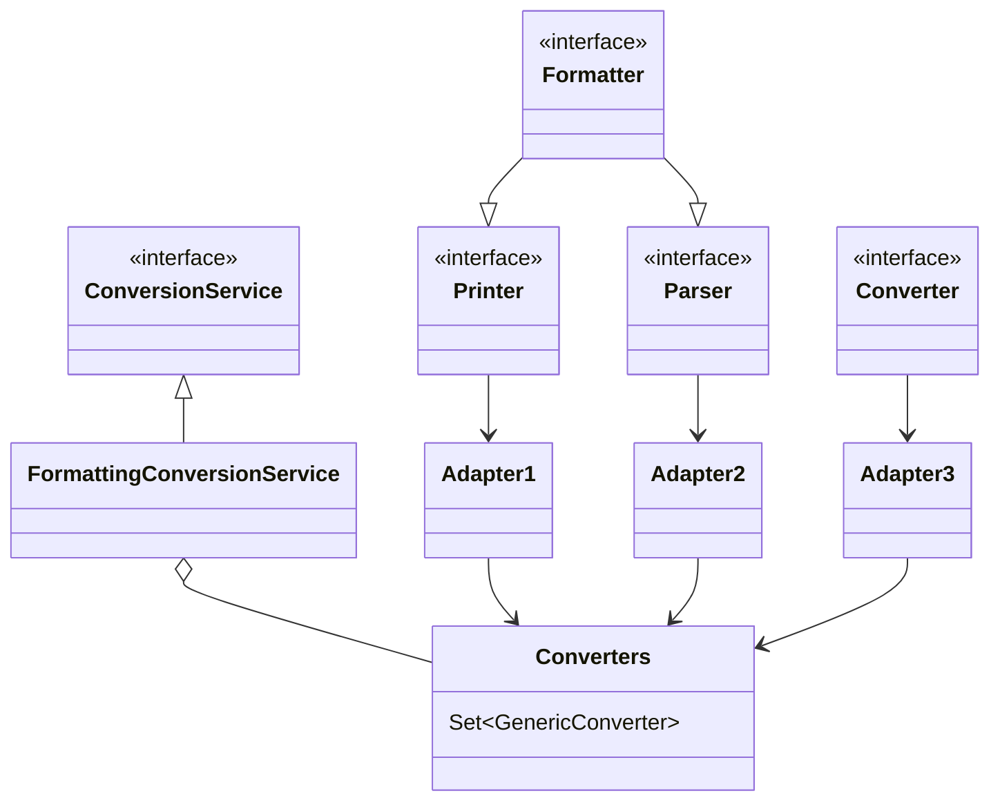
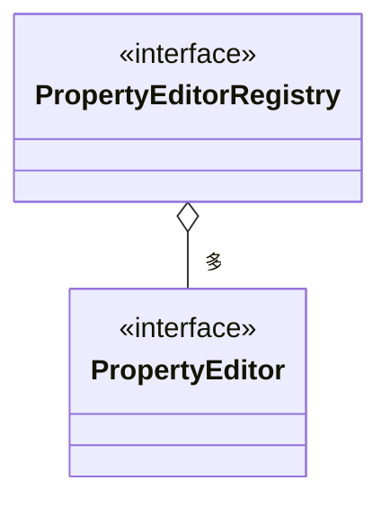
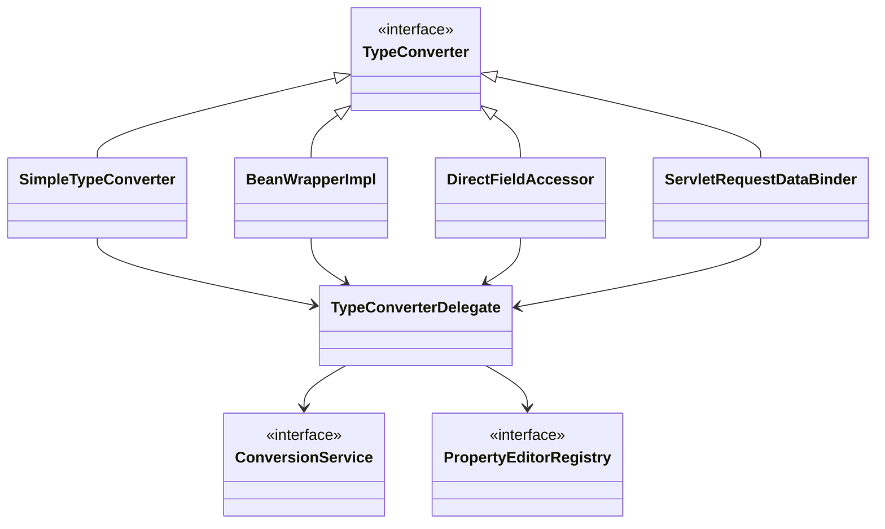
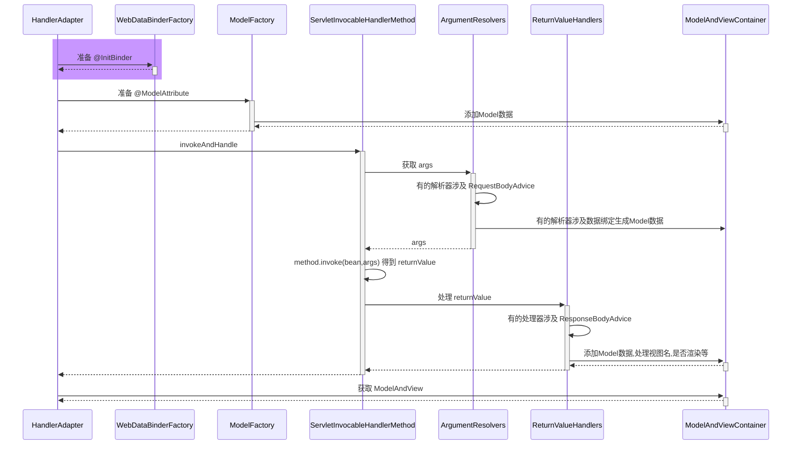
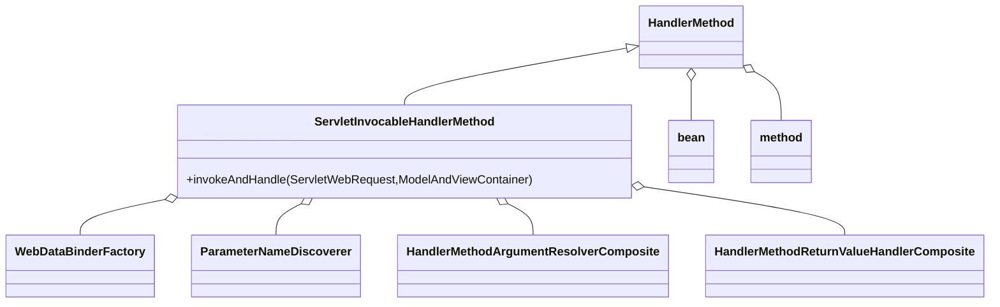
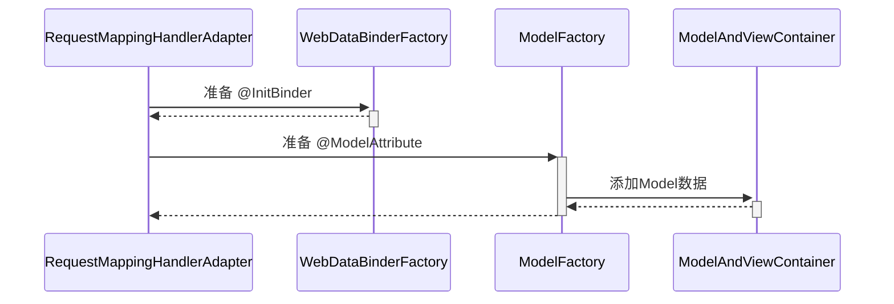
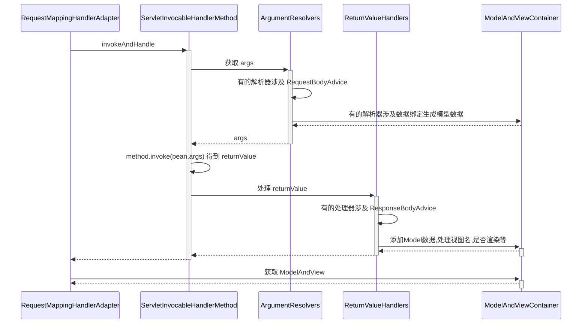
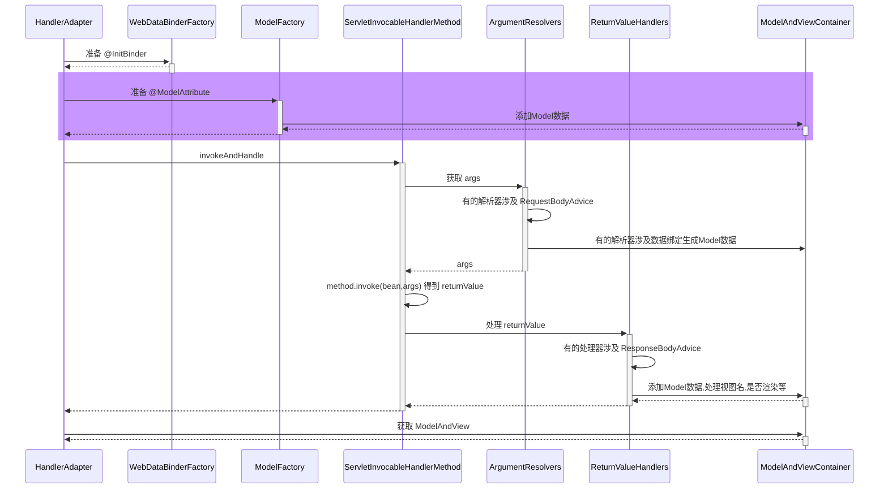
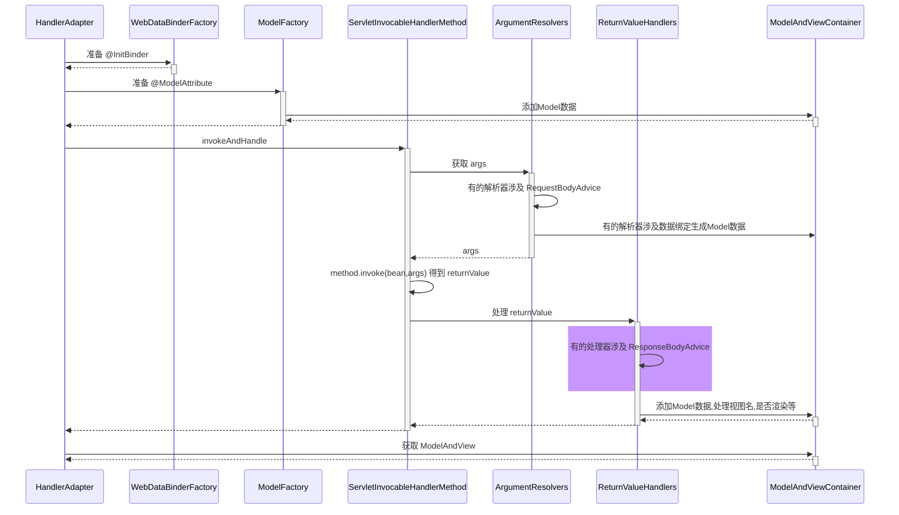

## WEB

### 20) RequestMappingHandlerMapping 与 RequestMappingHandlerAdapter

RequestMappingHandlerMapping 与 RequestMappingHandlerAdapter 俩是一对，分别用来

* 处理 @RequestMapping 映射
* 调用控制器方法、并处理方法参数与方法返回值

#### 演示1 - DispatcherServlet 初始化

#### 收获💡

1. DispatcherServlet 是在第一次被访问时执行初始化, 也可以通过配置修改为 Tomcat 启动后就初始化
2. 在初始化时会从 Spring 容器中找一些 Web 需要的组件, 如 HandlerMapping、HandlerAdapter 等，并逐一调用它们的初始化
3. RequestMappingHandlerMapping 初始化时，会收集所有 @RequestMapping 映射信息，封装为 Map，其中
   * key 是 RequestMappingInfo 类型，包括请求路径、请求方法等信息
   * value 是 HandlerMethod 类型，包括控制器方法对象、控制器对象
   * 有了这个 Map，就可以在请求到达时，快速完成映射，找到 HandlerMethod 并与匹配的拦截器一起返回给 DispatcherServlet
4. RequestMappingHandlerAdapter 初始化时，会准备 HandlerMethod 调用时需要的各个组件，如：
   * HandlerMethodArgumentResolver 解析控制器方法参数
   * HandlerMethodReturnValueHandler 处理控制器方法返回值


#### 演示2 - 自定义参数与返回值处理器

##### 代码参考

**com.itheima.a20.TokenArgumentResolver** ，**com.itheima.a20.YmlReturnValueHandler**

#### 收获💡

1. 体会参数解析器的作用
2. 体会返回值处理器的作用


### 21) 参数解析器

#### 演示 - 常见参数解析器

##### 代码参考

**com.itheima.a21** 包

#### 收获💡

1. 初步了解 RequestMappingHandlerAdapter 的调用过程
   1. 控制器方法被封装为 HandlerMethod
   2. 准备对象绑定与类型转换
   3. 准备 ModelAndViewContainer 用来存储中间 Model 结果
   4. 解析每个参数值
2. 解析参数依赖的就是各种参数解析器，它们都有两个重要方法
   * supportsParameter 判断是否支持方法参数
   * resolveArgument 解析方法参数
3. 常见参数的解析
   * @RequestParam
   * 省略 @RequestParam
   * @RequestParam(defaultValue)
   * MultipartFile
   * @PathVariable
   * @RequestHeader
   * @CookieValue
   * @Value
   * HttpServletRequest 等
   * @ModelAttribute
   * 省略 @ModelAttribute
   * @RequestBody
4. 组合模式在 Spring 中的体现
5. @RequestParam, @CookieValue 等注解中的参数名、默认值, 都可以写成活的, 即从 ${ } #{ }中获取


### 22) 参数名解析

#### 演示 - 两种方法获取参数名

##### 代码参考

**com.itheima.a22.A22**

#### 收获💡

1. 如果编译时添加了 -parameters 可以生成参数表, 反射时就可以拿到参数名
2. 如果编译时添加了 -g 可以生成调试信息, 但分为两种情况
   * 普通类, 会包含局部变量表, 用 asm 可以拿到参数名
   * 接口, 不会包含局部变量表, 无法获得参数名
     * 这也是 MyBatis 在实现 Mapper 接口时为何要提供 @Param 注解来辅助获得参数名


### 23) 对象绑定与类型转换

#### 底层第一套转换接口与实现



* Printer 把其它类型转为 String
* Parser 把 String 转为其它类型
* Formatter 综合 Printer 与 Parser 功能
* Converter 把类型 S 转为类型 T
* Printer、Parser、Converter 经过适配转换成 GenericConverter 放入 Converters 集合
* FormattingConversionService 利用其它们实现转换


#### 底层第二套转换接口



* PropertyEditor 把 String 与其它类型相互转换
* PropertyEditorRegistry 可以注册多个 PropertyEditor 对象
* 与第一套接口直接可以通过 FormatterPropertyEditorAdapter 来进行适配


#### 高层接口与实现



* 它们都实现了 TypeConverter 这个高层转换接口，在转换时，会用到 TypeConverter Delegate 委派ConversionService 与 PropertyEditorRegistry 真正执行转换（Facade 门面模式）
  * 首先看是否有自定义转换器, @InitBinder 添加的即属于这种 (用了适配器模式把 Formatter 转为需要的 PropertyEditor)
  * 再看有没有 ConversionService 转换
  * 再利用默认的 PropertyEditor 转换
  * 最后有一些特殊处理
* SimpleTypeConverter 仅做类型转换
* BeanWrapperImpl 为 bean 的属性赋值，当需要时做类型转换，走 Property
* DirectFieldAccessor 为 bean 的属性赋值，当需要时做类型转换，走 Field
* ServletRequestDataBinder 为 bean 的属性执行绑定，当需要时做类型转换，根据 directFieldAccess 选择走 Property 还是 Field，具备校验与获取校验结果功能


#### 演示1 - 类型转换与数据绑定

##### 代码参考

**com.itheima.a23** 包

#### 收获💡

基本的类型转换与数据绑定用法

* SimpleTypeConverter
* BeanWrapperImpl
* DirectFieldAccessor
* ServletRequestDataBinder


#### 演示2 - 数据绑定工厂

##### 代码参考

**com.itheima.a23.TestServletDataBinderFactory**

#### 收获💡

ServletRequestDataBinderFactory 的用法和扩展点

1. 可以解析控制器的 @InitBinder 标注方法作为扩展点，添加自定义转换器
   * 控制器私有范围
2. 可以通过 ConfigurableWebBindingInitializer 配置 ConversionService 作为扩展点，添加自定义转换器
   * 公共范围
3. 同时加了 @InitBinder 和 ConversionService 的转换优先级
   1. 优先采用 @InitBinder 的转换器
   2. 其次使用 ConversionService 的转换器
   3. 使用默认转换器
   4. 特殊处理（例如有参构造）


#### 演示3 - 获取泛型参数

##### 代码参考

**com.itheima.a23.sub** 包

#### 收获💡

1. java api 获取泛型参数
2. spring api 获取泛型参数


### 24) @ControllerAdvice 之 @InitBinder

#### 演示 - 准备 @InitBinder

**准备 @InitBinder** 在整个 HandlerAdapter 调用过程中所处的位置



* RequestMappingHandlerAdapter 在图中缩写为 HandlerAdapter
* HandlerMethodArgumentResolverComposite 在图中缩写为 ArgumentResolvers
* HandlerMethodReturnValueHandlerComposite 在图中缩写为 ReturnValueHandlers

#### 收获💡

1. RequestMappingHandlerAdapter 初始化时会解析 @ControllerAdvice 中的 @InitBinder 方法
2. RequestMappingHandlerAdapter 会以类为单位，在该类首次使用时，解析此类的 @InitBinder 方法
3. 以上两种 @InitBinder 的解析结果都会缓存来避免重复解析
4. 控制器方法调用时，会综合利用本类的 @InitBinder 方法和 @ControllerAdvice 中的 @InitBinder 方法创建绑定工厂


### 25) 控制器方法执行流程

#### 图1



HandlerMethod 需要

* bean 即是哪个 Controller
* method 即是 Controller 中的哪个方法

ServletInvocableHandlerMethod 需要

* WebDataBinderFactory 负责对象绑定、类型转换
* ParameterNameDiscoverer 负责参数名解析
* HandlerMethodArgumentResolverComposite 负责解析参数
* HandlerMethodReturnValueHandlerComposite 负责处理返回值


#### 图2



#### 图3




### 26) @ControllerAdvice 之 @ModelAttribute

#### 演示 - 准备 @ModelAttribute

##### 代码参考

**com.itheima.a26** 包

**准备 @ModelAttribute** 在整个 HandlerAdapter 调用过程中所处的位置



#### 收获💡

1. RequestMappingHandlerAdapter 初始化时会解析 @ControllerAdvice 中的 @ModelAttribute 方法
2. RequestMappingHandlerAdapter 会以类为单位，在该类首次使用时，解析此类的 @ModelAttribute 方法
3. 以上两种 @ModelAttribute 的解析结果都会缓存来避免重复解析
4. 控制器方法调用时，会综合利用本类的 @ModelAttribute 方法和 @ControllerAdvice 中的 @ModelAttribute 方法创建模型工厂


### 27) 返回值处理器

#### 演示 - 常见返回值处理器

##### 代码参考

**com.itheima.a27** 包

#### 收获💡

1. 常见的返回值处理器
   * ModelAndView，分别获取其模型和视图名，放入 ModelAndViewContainer
   * 返回值类型为 String 时，把它当做视图名，放入 ModelAndViewContainer
   * 返回值添加了 @ModelAttribute 注解时，将返回值作为模型，放入 ModelAndViewContainer
     * 此时需找到默认视图名
   * 返回值省略 @ModelAttribute 注解且返回非简单类型时，将返回值作为模型，放入 ModelAndViewContainer
     * 此时需找到默认视图名
   * 返回值类型为 ResponseEntity 时
     * 此时走 MessageConverter，并设置 ModelAndViewContainer.requestHandled 为 true
   * 返回值类型为 HttpHeaders 时
     * 会设置 ModelAndViewContainer.requestHandled 为 true
   * 返回值添加了 @ResponseBody 注解时
     * 此时走 MessageConverter，并设置 ModelAndViewContainer.requestHandled 为 true
2. 组合模式在 Spring 中的体现 + 1


### 28) MessageConverter

#### 演示 - MessageConverter 的作用

##### 代码参考

**com.itheima.a28.A28**

#### 收获💡

1. MessageConverter 的作用
   * @ResponseBody 是返回值处理器解析的
   * 但具体转换工作是 MessageConverter 做的
2. 如何选择 MediaType
   * 首先看 @RequestMapping 上有没有指定
   * 其次看 request 的 Accept 头有没有指定
   * 最后按 MessageConverter 的顺序, 谁能谁先转换


### 29) @ControllerAdvice 之 ResponseBodyAdvice

#### 演示 - ResponseBodyAdvice 增强

##### 代码参考

**com.itheima.a29** 包

**ResponseBodyAdvice 增强** 在整个 HandlerAdapter 调用过程中所处的位置



#### 收获💡

1. ResponseBodyAdvice 返回响应体前包装


### 30) 异常解析器

#### 演示 - ExceptionHandlerExceptionResolver

##### 代码参考

**com.itheima.a30.A30**

#### 收获💡

1. 它能够重用参数解析器、返回值处理器，实现组件重用
2. 它能够支持嵌套异常


### 31) @ControllerAdvice 之 @ExceptionHandler

#### 演示 - 准备 @ExceptionHandler

##### 代码参考

**com.itheima.a31** 包

#### 收获💡

1. ExceptionHandlerExceptionResolver 初始化时会解析 @ControllerAdvice 中的 @ExceptionHandler 方法
2. ExceptionHandlerExceptionResolver 会以类为单位，在该类首次处理异常时，解析此类的 @ExceptionHandler 方法
3. 以上两种 @ExceptionHandler 的解析结果都会缓存来避免重复解析


### 32) Tomcat 异常处理

* 我们知道 @ExceptionHandler 只能处理发生在 mvc 流程中的异常，例如控制器内、拦截器内，那么如果是 Filter 出现了异常，如何进行处理呢？

* 在 Spring Boot 中，是这么实现的：
  1. 因为内嵌了 Tomcat 容器，因此可以配置 Tomcat 的错误页面，Filter 与 错误页面之间是通过请求转发跳转的，可以在这里做手脚
  2. 先通过 ErrorPageRegistrarBeanPostProcessor 这个后处理器配置错误页面地址，默认为 `/error` 也可以通过 `${server.error.path}` 进行配置
  3. 当 Filter 发生异常时，不会走 Spring 流程，但会走 Tomcat 的错误处理，于是就希望转发至 `/error` 这个地址
     * 当然，如果没有 @ExceptionHandler，那么最终也会走到 Tomcat 的错误处理
  4. Spring Boot 又提供了一个 BasicErrorController，它就是一个标准 @Controller，@RequestMapping 配置为 `/error`，所以处理异常的职责就又回到了 Spring
  5. 异常信息由于会被 Tomcat 放入 request 作用域，因此 BasicErrorController 里也能获取到
  6. 具体异常信息会由 DefaultErrorAttributes 封装好
  7. BasicErrorController 通过 Accept 头判断需要生成哪种 MediaType 的响应
     * 如果要的不是 text/html，走 MessageConverter 流程
     * 如果需要 text/html，走 mvc 流程，此时又分两种情况
       * 配置了 ErrorViewResolver，根据状态码去找 View
       * 没配置或没找到，用 BeanNameViewResolver 根据一个固定为 error 的名字找到 View，即所谓的 WhitelabelErrorView

> ***评价***
>
> * 一个错误处理搞得这么复杂，就问恶心不？


#### 演示1 - 错误页处理

##### 关键代码

```java
@Bean // ⬅️修改了 Tomcat 服务器默认错误地址, 出错时使用请求转发方式跳转
public ErrorPageRegistrar errorPageRegistrar() {
    return webServerFactory -> webServerFactory.addErrorPages(new ErrorPage("/error"));
}

@Bean // ⬅️TomcatServletWebServerFactory 初始化前用它增强, 注册所有 ErrorPageRegistrar
public ErrorPageRegistrarBeanPostProcessor errorPageRegistrarBeanPostProcessor() {
    return new ErrorPageRegistrarBeanPostProcessor();
}
```

#### 收获💡

1. Tomcat 的错误页处理手段


#### 演示2 - BasicErrorController

##### 关键代码

```java
@Bean // ⬅️ErrorProperties 封装环境键值, ErrorAttributes 控制有哪些错误信息
public BasicErrorController basicErrorController() {
    ErrorProperties errorProperties = new ErrorProperties();
    errorProperties.setIncludeException(true);
    return new BasicErrorController(new DefaultErrorAttributes(), errorProperties);
}

@Bean // ⬅️名称为 error 的视图, 作为 BasicErrorController 的 text/html 响应结果
public View error() {
    return new View() {
        @Override
        public void render(
            Map<String, ?> model, 
            HttpServletRequest request, 
            HttpServletResponse response
        ) throws Exception {
            System.out.println(model);
            response.setContentType("text/html;charset=utf-8");
            response.getWriter().print("""
                    <h3>服务器内部错误</h3>
                    """);
        }
    };
}

@Bean // ⬅️收集容器中所有 View 对象, bean 的名字作为视图名
public ViewResolver viewResolver() {
    return new BeanNameViewResolver();
}
```

#### 收获💡

1. Spring Boot 中 BasicErrorController 如何工作


### 33) BeanNameUrlHandlerMapping 与 SimpleControllerHandlerAdapter

#### 演示 - 本组映射器和适配器

##### 关键代码

```java
@Bean
public BeanNameUrlHandlerMapping beanNameUrlHandlerMapping() {
    return new BeanNameUrlHandlerMapping();
}

@Bean
public SimpleControllerHandlerAdapter simpleControllerHandlerAdapter() {
    return new SimpleControllerHandlerAdapter();
}

@Bean("/c3")
public Controller controller3() {
    return (request, response) -> {
        response.getWriter().print("this is c3");
        return null;
    };
}
```

#### 收获💡

1. BeanNameUrlHandlerMapping，以 / 开头的 bean 的名字会被当作映射路径
2. 这些 bean 本身当作 handler，要求实现 Controller 接口
3. SimpleControllerHandlerAdapter，调用 handler
4. 模拟实现这组映射器和适配器


### 34) RouterFunctionMapping 与 HandlerFunctionAdapter

#### 演示 - 本组映射器和适配器

##### 关键代码

```java
@Bean
public RouterFunctionMapping routerFunctionMapping() {
    return new RouterFunctionMapping();
}

@Bean
public HandlerFunctionAdapter handlerFunctionAdapter() {
    return new HandlerFunctionAdapter();
}

@Bean
public RouterFunction<ServerResponse> r1() {
    //           ⬇️映射条件   ⬇️handler
    return route(GET("/r1"), request -> ok().body("this is r1"));
}
```

#### 收获💡

1. RouterFunctionMapping, 通过 RequestPredicate 条件映射
2. handler 要实现 HandlerFunction 接口
3. HandlerFunctionAdapter, 调用 handler


### 35) SimpleUrlHandlerMapping 与 HttpRequestHandlerAdapter

#### 演示1 - 本组映射器和适配器

##### 代码参考

**org.springframework.boot.autoconfigure.web.servlet.A35**

##### 关键代码

```java
@Bean
public SimpleUrlHandlerMapping simpleUrlHandlerMapping(ApplicationContext context) {
    SimpleUrlHandlerMapping handlerMapping = new SimpleUrlHandlerMapping();
    Map<String, ResourceHttpRequestHandler> map 
        = context.getBeansOfType(ResourceHttpRequestHandler.class);
    handlerMapping.setUrlMap(map);
    return handlerMapping;
}

@Bean
public HttpRequestHandlerAdapter httpRequestHandlerAdapter() {
    return new HttpRequestHandlerAdapter();
}

@Bean("/**")
public ResourceHttpRequestHandler handler1() {
    ResourceHttpRequestHandler handler = new ResourceHttpRequestHandler();
    handler.setLocations(List.of(new ClassPathResource("static/")));
    return handler;
}

@Bean("/img/**")
public ResourceHttpRequestHandler handler2() {
    ResourceHttpRequestHandler handler = new ResourceHttpRequestHandler();
    handler.setLocations(List.of(new ClassPathResource("images/")));
    return handler;
}
```

#### 收获💡

1. SimpleUrlHandlerMapping 不会在初始化时收集映射信息，需要手动收集
2. SimpleUrlHandlerMapping 映射路径
3. ResourceHttpRequestHandler 作为静态资源 handler
4. HttpRequestHandlerAdapter, 调用此 handler


#### 演示2 - 静态资源解析优化

##### 关键代码

```java
@Bean("/**")
public ResourceHttpRequestHandler handler1() {
    ResourceHttpRequestHandler handler = new ResourceHttpRequestHandler();
    handler.setLocations(List.of(new ClassPathResource("static/")));
    handler.setResourceResolvers(List.of(
        	// ⬇️缓存优化
            new CachingResourceResolver(new ConcurrentMapCache("cache1")),
        	// ⬇️压缩优化
            new EncodedResourceResolver(),
        	// ⬇️原始资源解析
            new PathResourceResolver()
    ));
    return handler;
}
```

#### 收获💡

1. 责任链模式体现
2. 压缩文件需要手动生成


#### 演示3 - 欢迎页

##### 关键代码

```java
@Bean
public WelcomePageHandlerMapping welcomePageHandlerMapping(ApplicationContext context) {
    Resource resource = context.getResource("classpath:static/index.html");
    return new WelcomePageHandlerMapping(null, context, resource, "/**");
}

@Bean
public SimpleControllerHandlerAdapter simpleControllerHandlerAdapter() {
    return new SimpleControllerHandlerAdapter();
}
```

#### 收获💡

1. 欢迎页支持静态欢迎页与动态欢迎页
2. WelcomePageHandlerMapping 映射欢迎页（即只映射 '/'）
   * 它内置的 handler ParameterizableViewController 作用是不执行逻辑，仅根据视图名找视图
   * 视图名固定为 forward:index.html
3. SimpleControllerHandlerAdapter, 调用 handler
   * 转发至 /index.html
   * 处理 /index.html 又会走上面的静态资源处理流程


#### 映射器与适配器小结

1. HandlerMapping 负责建立请求与控制器之间的映射关系
   * RequestMappingHandlerMapping (与 @RequestMapping 匹配)
   * WelcomePageHandlerMapping    (/)
   * BeanNameUrlHandlerMapping    (与 bean 的名字匹配 以 / 开头)
   * RouterFunctionMapping        (函数式 RequestPredicate, HandlerFunction)
   * SimpleUrlHandlerMapping      (静态资源 通配符 /** /img/**)
   * 之间也会有顺序问题, boot 中默认顺序如上
2. HandlerAdapter 负责实现对各种各样的 handler 的适配调用
   * RequestMappingHandlerAdapter 处理：@RequestMapping 方法
     * 参数解析器、返回值处理器体现了组合模式
   * SimpleControllerHandlerAdapter 处理：Controller 接口
   * HandlerFunctionAdapter 处理：HandlerFunction 函数式接口
   * HttpRequestHandlerAdapter 处理：HttpRequestHandler 接口 (静态资源处理)
   * 这也是典型适配器模式体现


### 36) mvc 处理流程

当浏览器发送一个请求 `http://localhost:8080/hello` 后，请求到达服务器，其处理流程是：

1. 服务器提供了 DispatcherServlet，它使用的是标准 Servlet 技术

   * 路径：默认映射路径为 `/`，即会匹配到所有请求 URL，可作为请求的统一入口，也被称之为**前控制器**
     * jsp 不会匹配到 DispatcherServlet
     * 其它有路径的 Servlet 匹配优先级也高于 DispatcherServlet
   * 创建：在 Boot 中，由 DispatcherServletAutoConfiguration 这个自动配置类提供 DispatcherServlet 的 bean
   * 初始化：DispatcherServlet 初始化时会优先到容器里寻找各种组件，作为它的成员变量
     * HandlerMapping，初始化时记录映射关系
     * HandlerAdapter，初始化时准备参数解析器、返回值处理器、消息转换器
     * HandlerExceptionResolver，初始化时准备参数解析器、返回值处理器、消息转换器
     * ViewResolver
2. DispatcherServlet 会利用 RequestMappingHandlerMapping 查找控制器方法

   * 例如根据 /hello 路径找到 @RequestMapping("/hello") 对应的控制器方法

   * 控制器方法会被封装为 HandlerMethod 对象，并结合匹配到的拦截器一起返回给 DispatcherServlet 

   * HandlerMethod 和拦截器合在一起称为 HandlerExecutionChain（调用链）对象
3. DispatcherServlet 接下来会：

   1. 调用拦截器的 preHandle 方法
   2. RequestMappingHandlerAdapter 调用 handle 方法，准备数据绑定工厂、模型工厂、ModelAndViewContainer、将 HandlerMethod 完善为 ServletInvocableHandlerMethod
      * @ControllerAdvice 全局增强点1️⃣：补充模型数据
      * @ControllerAdvice 全局增强点2️⃣：补充自定义类型转换器
      * 使用 HandlerMethodArgumentResolver 准备参数
        * @ControllerAdvice 全局增强点3️⃣：RequestBody 增强
      * 调用 ServletInvocableHandlerMethod 
      * 使用 HandlerMethodReturnValueHandler 处理返回值
        * @ControllerAdvice 全局增强点4️⃣：ResponseBody 增强
      * 根据 ModelAndViewContainer 获取 ModelAndView
        * 如果返回的 ModelAndView 为 null，不走第 4 步视图解析及渲染流程
          * 例如，有的返回值处理器调用了 HttpMessageConverter 来将结果转换为 JSON，这时 ModelAndView 就为 null
        * 如果返回的 ModelAndView 不为 null，会在第 4 步走视图解析及渲染流程
   3. 调用拦截器的 postHandle 方法
   4. 处理异常或视图渲染
      * 如果 1~3 出现异常，走 ExceptionHandlerExceptionResolver 处理异常流程
        * @ControllerAdvice 全局增强点5️⃣：@ExceptionHandler 异常处理
      * 正常，走视图解析及渲染流程
   5. 调用拦截器的 afterCompletion 方法