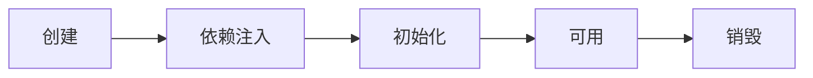
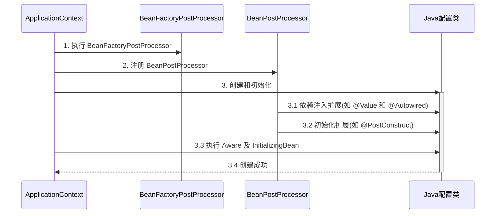
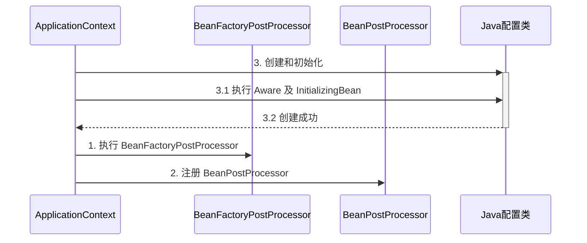
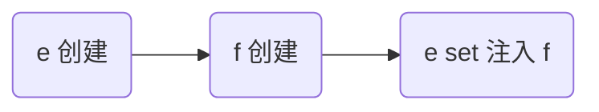
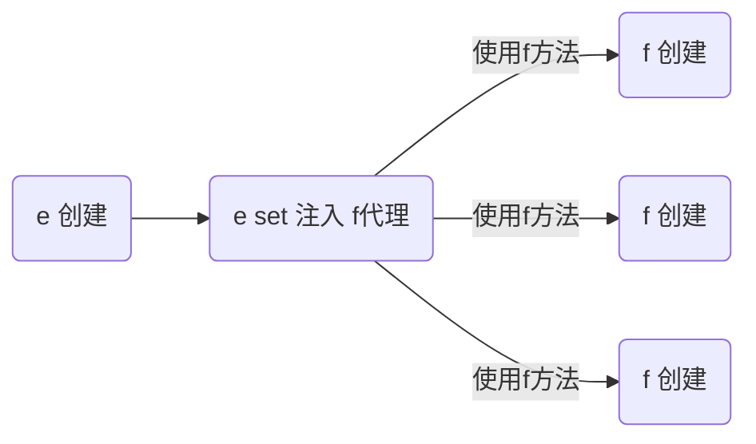

## 容器与 bean

### 1) 容器接口

* BeanFactory 接口，典型功能有：
  * getBean

* ApplicationContext 接口，是 BeanFactory 的子接口。它扩展了 BeanFactory 接口的功能，如：
  * 国际化
  * 通配符方式获取一组 Resource 资源
  * 整合 Environment 环境（能通过它获取各种来源的配置信息）
  * 事件发布与监听，实现组件之间的解耦

可以看到，我们课上讲的，都是 BeanFactory 提供的基本功能，ApplicationContext 中的扩展功能都没有用到。


#### 演示1 - BeanFactory 与 ApplicationContext 的区别

#### 收获💡

通过这个示例结合 debug 查看 ApplicationContext 对象的内部结构，学到：

1. 到底什么是 BeanFactory

   - 它是 ApplicationContext 的父接口
   - 它才是 Spring 的核心容器, 主要的 ApplicationContext 实现都【组合】了它的功能，【组合】是指 ApplicationContext 的一个重要成员变量就是 BeanFactory

2. BeanFactory 能干点啥

   - 表面上只有 getBean

   - 实际上控制反转、基本的依赖注入、直至 Bean 的生命周期的各种功能，都由它的实现类提供

     ```java
     public class DefaultSingletonBeanRegistry extends SimpleAliasRegistry implements SingletonBeanRegistry {
         private final Map<String, Object> singletonObjects = new ConcurrentHashMap(256);
         private final Map<String, ObjectFactory<?>> singletonFactories = new HashMap(16);
     ```

   - 例子中通过反射查看了它的成员变量 singletonObjects，内部包含了所有的单例 bean

3. ApplicationContext 比 BeanFactory 多点啥

   * ApplicationContext 组合并扩展了 BeanFactory 的功能

   * 国际化、通配符方式获取一组 Resource 资源、整合 Environment 环境、事件发布与监听

     ```java
     public interface MessageSource {  //国际化功能
         @Nullable
         String getMessage(String var1, @Nullable Object[] var2, @Nullable String var3, Locale var4);
     
         String getMessage(String var1, @Nullable Object[] var2, Locale var3) throws NoSuchMessageException;
     
         String getMessage(MessageSourceResolvable var1, Locale var2) throws NoSuchMessageException;
     
     ```

     ```java
     public interface ResourcePatternResolver extends ResourceLoader { //通配符匹配资源
         String CLASSPATH_ALL_URL_PREFIX = "classpath*:";
     
         Resource[] getResources(String var1) throws IOException;
     }
     ```

     ```java
     @FunctionalInterface
     public interface ApplicationEventPublisher { //发布事件对象
         default void publishEvent(ApplicationEvent event) {
             this.publishEvent((Object)event);
         }
     
         void publishEvent(Object var1);
     }
     ```

     ```java
     public interface EnvironmentCapable { //读取系统环境变量
         Environment getEnvironment();
     }
     ```

   * 新学一种代码之间解耦途径，事件解耦

     ```java
     //用户注册事件
     @Autowired 
     private ApplicationEventPublisher context;//事件发布器
     
     
     public void register(){
     	context.publishEvent(new UserRegisteredEvent(this));
     }
     
     
     //另一个包
     @EventListener
     public void aaa(UserRegisteredEvent event){
     	//处理业务
     }
     ```

     

建议练习：完成用户注册与发送短信之间的解耦，用事件方式、和 AOP 方式分别实现

> ***注意***
>
> * 如果 jdk > 8, 运行时请添加 --add-opens java.base/java.lang=ALL-UNNAMED，这是因为这些版本的 jdk 默认不允许跨 module 反射
> * 事件发布还可以异步，这个视频中没有展示，请自行查阅 @EnableAsync，@Async 的用法


#### 演示2 - 国际化

```java
public class TestMessageSource {
    public static void main(String[] args) {
        GenericApplicationContext context = new GenericApplicationContext();

        context.registerBean("messageSource", MessageSource.class, () -> {
            ResourceBundleMessageSource ms = new ResourceBundleMessageSource();
            ms.setDefaultEncoding("utf-8");
            ms.setBasename("messages");
            return ms;
        });

        context.refresh();

        System.out.println(context.getMessage("hi", null, Locale.ENGLISH));
        System.out.println(context.getMessage("hi", null, Locale.CHINESE));
        System.out.println(context.getMessage("hi", null, Locale.JAPANESE));
    }
}
```

国际化文件均在 src/resources 目录下

messages.properties（空）

messages_en.properties

```properties
hi=Hello
```

messages_ja.properties

```properties
hi=こんにちは
```

messages_zh.properties

```properties
hi=你好
```

> ***注意***
>
> * ApplicationContext 中 MessageSource bean 的名字固定为 messageSource
> * 使用 SpringBoot 时，国际化文件名固定为 messages
> * 空的 messages.properties 也必须存在


### 2) 容器实现

Spring 的发展历史较为悠久，因此很多资料还在讲解它较旧的实现，这里出于怀旧的原因，把它们都列出来，供大家参考

* DefaultListableBeanFactory，是 BeanFactory 最重要的实现，像**控制反转**和**依赖注入**功能，都是它来实现

  ```java
   DefaultListableBeanFactory beanFactory = new DefaultListableBeanFactory();
          AbstractBeanDefinition beanDefinition = BeanDefinitionBuilder.genericBeanDefinition(Config.class).setScope("singleton").getBeanDefinition();
          beanFactory.registerBeanDefinition("config", beanDefinition);
          //注册后处理器
          AnnotationConfigUtils.registerAnnotationConfigProcessors(beanFactory);
          //解析Bean后处理器
          beanFactory.getBeansOfType(BeanFactoryPostProcessor.class).values().stream().forEach(beanFactoryPostProcessor -> {
              beanFactoryPostProcessor.postProcessBeanFactory(beanFactory);
          });
  
          for (String beanDefinitionName : beanFactory.getBeanDefinitionNames()) {
              System.out.println(beanDefinitionName);
          }
  ```

* ClassPathXmlApplicationContext，从类路径查找 XML 配置文件，创建容器（旧）

* FileSystemXmlApplicationContext，从磁盘路径查找 XML 配置文件，创建容器（旧）

* XmlWebApplicationContext，传统 SSM 整合时，基于 XML 配置文件的容器（旧）

* AnnotationConfigWebApplicationContext，传统 SSM 整合时，基于 java 配置类的容器（旧）

* AnnotationConfigApplicationContext，Spring boot 中非 web 环境容器（新）

* AnnotationConfigServletWebServerApplicationContext，Spring boot 中 servlet web 环境容器（新）

* AnnotationConfigReactiveWebServerApplicationContext，Spring boot 中 reactive web 环境容器（新）

另外要注意的是，后面这些带有 ApplicationContext 的类都是 ApplicationContext 接口的实现，但它们是**组合**了 DefaultListableBeanFactory 的功能，并非继承而来


#### 演示1 - DefaultListableBeanFactory

#### 收获💡

* beanFactory 可以通过 registerBeanDefinition 注册一个 bean definition 对象

  * 我们平时使用的配置类、xml、组件扫描等方式都是生成 bean definition 对象注册到 beanFactory 当中

  * bean definition 描述了这个 bean 的创建蓝图：scope 是什么、用构造还是工厂创建、初始化销毁方法是什么，等等

    ```java
    public class BeanFactory {
        public static void main(String[] args) {
            DefaultListableBeanFactory beanFactory = new DefaultListableBeanFactory();
            //需要bean定义(class scope init destroy
            AbstractBeanDefinition beanDefinition =
                    BeanDefinitionBuilder.genericBeanDefinition(Config.class).setScope("singleton").getBeanDefinition();
            //注册bean definition到bean factory 指定名字为config
            beanFactory.registerBeanDefinition("config",beanDefinition);
            //此时只有config 没有解析@Bean
    
            //给bean factory 添加常用后置处理器
            AnnotationConfigUtils.registerAnnotationConfigProcessors(beanFactory);
            //org.springframework.context.annotation.internalConfigurationAnnotationProcessor  处理configuration注解
            //org.springframework.context.annotation.internalAutowiredAnnotationProcessor   处理autowired注解
            //org.springframework.context.annotation.internalCommonAnnotationProcessor       处理其他系统内置注解
            //org.springframework.context.event.internalEventListenerProcessor
            //org.springframework.context.event.internalEventListenerFactory
    
    
            //拿到所有bean factory 后处理器
            beanFactory.getBeansOfType(BeanFactoryPostProcessor.class).values().forEach(beanFactoryPostProcessor->{
                //执行bean factory 后处理器
                beanFactoryPostProcessor.postProcessBeanFactory(beanFactory);
            });
    
            //此时出现bean1 bean2
            //config
            //org.springframework.context.annotation.internalConfigurationAnnotationProcessor
            //org.springframework.context.annotation.internalAutowiredAnnotationProcessor
            //org.springframework.context.annotation.internalCommonAnnotationProcessor
            //org.springframework.context.event.internalEventListenerProcessor
            //org.springframework.context.event.internalEventListenerFactory
            //bean1
            //bean2
    		//bean后处理区 注册后处理器 针对bean生命周期的提供扩展的内容
            beanFactory.getBeansOfType(BeanPostProcessor.class).values().forEach(beanFactory::addBeanPostProcessor);
            
            for (String beanDefinitionName : beanFactory.getBeanDefinitionNames()) {
                System.out.println(beanDefinitionName);
            }
        }
    
        @Configuration
        static class Config{
            @Bean
            public Bean1 bean1(){
                return new Bean1();
            }
    
            @Bean
            public Bean2 bean2(){
                return new Bean2();
            }
        }
        static class Bean1{
            public  Bean1(){
                System.out.println("constructor bean1");
            }
    
            @Autowired
            private Bean2 bean2;
    
            public Bean2 getBean2(){
                return bean2;
            }
        }
    
        static class Bean2{
            public Bean2(){
                System.out.println("constructor bean2");
            }
        }
    }
    ```

    

* beanFactory 需要手动调用 beanFactory 后处理器对它做增强

  * 例如通过解析 @Bean、@ComponentScan 等注解，来补充一些 bean definition

* beanFactory 需要手动添加 bean 后处理器，以便对后续 bean 的创建过程提供增强

  * 例如 @Autowired，@Resource 等注解的解析都是 bean 后处理器完成的
  * bean 后处理的添加顺序会对解析结果有影响，见视频中同时加 @Autowired，@Resource 的例子

* beanFactory 需要手动调用方法来初始化单例

* beanFactory 需要额外设置才能解析 ${} 与 #{}


#### 演示2 - 常见 ApplicationContext 实现

#### 收获💡

1. 常见的 ApplicationContext 容器实现
2. 内嵌容器、DispatcherServlet 的创建方法、作用

```java
public class ApplicationContext {
    public static void main(String[] args) {
        //从xml配置创建容器
        ClassPathXmlApplicationContext xmlContext = new ClassPathXmlApplicationContext();
        //从系统路径创建容器
        FileSystemXmlApplicationContext fileContext = new FileSystemXmlApplicationContext();

        //将xml的数据读入beanfactory
        DefaultListableBeanFactory beanFactory = new DefaultListableBeanFactory();
        XmlBeanDefinitionReader reader = new XmlBeanDefinitionReader(beanFactory);
        reader.loadBeanDefinitions(new ClassPathResource("xml"));

        //用注解方式配置容器
        AnnotationConfigApplicationContext annotationConfigApplicationContext =
                new AnnotationConfigApplicationContext();

        //基于java配置类来创建 用于web环境
        AnnotationConfigServletWebApplicationContext annotationConfigServletWebApplicationContext =
                new AnnotationConfigServletWebApplicationContext(WebConfig.class);

    }

    @Configuration
    static class WebConfig{
        @Bean
        public ServletWebServerFactory servletWebServerFactory(){
            return new TomcatServletWebServerFactory();
        }
        @Bean
        public DispatcherServlet dispatcherServlet(){
            return  new DispatcherServlet();
        }
        @Bean
        public DispatcherServletRegistrationBean registrationBean(DispatcherServlet dispatcherServlet){
            return  new DispatcherServletRegistrationBean(dispatcherServlet,"/");
        }
        @Bean("/hello")
        public Controller controller(){
            return ((request, response) ->
            {
                response.getWriter().println("hello");
                return null;
            });
        }

    }

    static class Bean1{
        public  Bean1(){
            System.out.println("constructor bean1");
        }

        @Autowired
        private BeanFactory.Bean2 bean2;

        public BeanFactory.Bean2 getBean2(){
            return bean2;
        }
    }

    static class Bean2{
        public Bean2(){
            System.out.println("constructor bean2");
        }
    }
}
```


### 3) Bean 的生命周期

一个受 Spring 管理的 bean，生命周期主要阶段有

1. 创建：根据 bean 的构造方法或者工厂方法来创建 bean 实例对象
2. 依赖注入：根据 @Autowired，@Value 或其它一些手段，为 bean 的成员变量填充值、建立关系
3. 初始化：回调各种 Aware 接口，调用对象的各种初始化方法
4. 销毁：在容器关闭时，会销毁所有单例对象（即调用它们的销毁方法）
   * prototype 对象也能够销毁，不过需要容器这边主动调用

一些资料会提到，生命周期中还有一类 bean 后处理器：BeanPostProcessor，会在 bean 的初始化的前后，提供一些扩展逻辑。但这种说法是不完整的，见下面的演示1


#### 演示1 - bean 生命周期




创建前后的增强

* postProcessBeforeInstantiation
  * 这里返回的对象若不为 null 会替换掉原本的 bean，并且仅会走 postProcessAfterInitialization 流程
* postProcessAfterInstantiation
  * 这里如果返回 false 会跳过依赖注入阶段

依赖注入前的增强

* postProcessProperties
  * 如 @Autowired、@Value、@Resource 

初始化前后的增强

* postProcessBeforeInitialization
  * 这里返回的对象会替换掉原本的 bean
  * 如 @PostConstruct、@ConfigurationProperties
* postProcessAfterInitialization 
  * 这里返回的对象会替换掉原本的 bean
  * 如代理增强

销毁之前的增强

* postProcessBeforeDestruction
  * 如 @PreDestroy 

#### 收获💡

1. Spring bean 生命周期各个阶段
2. 模板设计模式, 指大流程已经固定好了, 通过接口回调（bean 后处理器）在一些关键点前后提供扩展


#### 演示2 - 模板方法设计模式

##### 关键代码

```java
public class TestMethodTemplate {

    public static void main(String[] args) {
        MyBeanFactory beanFactory = new MyBeanFactory();
        beanFactory.addBeanPostProcessor(bean -> System.out.println("解析 @Autowired"));
        beanFactory.addBeanPostProcessor(bean -> System.out.println("解析 @Resource"));
        beanFactory.getBean();
    }

    // 模板方法  Template Method Pattern
    static class MyBeanFactory {
        public Object getBean() {
            Object bean = new Object();
            System.out.println("构造 " + bean);
            System.out.println("依赖注入 " + bean); // @Autowired, @Resource
            for (BeanPostProcessor processor : processors) {
                processor.inject(bean);
            }
            System.out.println("初始化 " + bean);
            return bean;
        }

        private List<BeanPostProcessor> processors = new ArrayList<>();

        public void addBeanPostProcessor(BeanPostProcessor processor) {
            processors.add(processor);
        }
    }
    
    static interface BeanPostProcessor {
        public void inject(Object bean); // 对依赖注入阶段的扩展
    }
}
```


#### 演示3 - bean 后处理器排序

#### 收获💡

1. 实现了 PriorityOrdered 接口的优先级最高

2. 实现了 Ordered 接口与加了 @Order 注解的平级, 按数字升序

3. 其它的排在最后

   

   


### 4) Bean 后处理器

#### 演示1 - 后处理器作用

#### 收获💡

1. @Autowired 等注解的解析属于 bean 生命周期阶段（依赖注入, 初始化）的扩展功能，这些扩展功能由 bean 后处理器来完成
2. 每个后处理器各自增强什么功能
   * AutowiredAnnotationBeanPostProcessor 解析 @Autowired 与 @Value
   * CommonAnnotationBeanPostProcessor 解析 @Resource、@PostConstruct、@PreDestroy
   * ConfigurationPropertiesBindingPostProcessor 解析 @ConfigurationProperties
3. 另外 ContextAnnotationAutowireCandidateResolver 负责获取 @Value 的值，解析 @Qualifier、泛型、@Lazy 等

```java
public class BeanPostProcessor {
    public static void main(String[] args) {
        GenericApplicationContext context = new GenericApplicationContext();
        
        //解析Autowired Value
        context.getDefaultListableBeanFactory().setAutowireCandidateResolver(new ContextAnnotationAutowireCandidateResolver());
        context.registerBean(AutowiredAnnotationBeanPostProcessor.class);
        
        context.registerBean(CommonAnnotationBeanPostProcessor.class);
        //解析@Resource @PostConstruct @PreDestroy
        
        ConfigurationPropertiesBindingPostProcessor.register(context.getDefaultListableBeanFactory()); //@ConfigurationProperties
        context.refresh();
        context.close();
    }
}
```


#### 演示2 - @Autowired bean 后处理器运行分析

#### 收获💡

1. AutowiredAnnotationBeanPostProcessor.findAutowiringMetadata 用来获取某个 bean 上加了 @Value @Autowired 的成员变量，方法参数的信息，表示为 InjectionMetadata
2. InjectionMetadata 可以完成依赖注入
3. InjectionMetadata 内部根据成员变量，方法参数封装为 DependencyDescriptor 类型
4. 有了 DependencyDescriptor，就可以利用 beanFactory.doResolveDependency 方法进行基于类型的查找

```
public static void main(String[] args) throws Throwable {
        GenericApplicationContext context = new GenericApplicationContext();

        //解析Autowired Value
        context.getDefaultListableBeanFactory().setAutowireCandidateResolver(new ContextAnnotationAutowireCandidateResolver());
        context.registerBean(AutowiredAnnotationBeanPostProcessor.class);

        //@Autowired解析过程
        AutowiredAnnotationBeanPostProcessor processor = new AutowiredAnnotationBeanPostProcessor();
        //注册beanfactory
        processor.setBeanFactory(context.getDefaultListableBeanFactory());
        //执行依赖注入
        processor.postProcessProperties(null,null,null);

        Method findAutowiringMetadata = AutowiredAnnotationBeanPostProcessor.class.
                getDeclaredMethod("findAutowiringMetadata", String.class, Class.class, PropertyValues.class);
        findAutowiringMetadata.setAccessible(true);
        //获取那些方法和变量加了@autowired
        InjectionMetadata metadata = (InjectionMetadata) findAutowiringMetadata.invoke(processor, null);
        //注入
        metadata.inject(null,null,null);

        //根据类型查找值
        //成员变量根据类型找bean完成注入 方法根据参数类型找 Field Method Value均可
        Field bean1 = Bean1.class.getDeclaredField("bean1");
        DependencyDescriptor dd1 = new DependencyDescriptor(bean1,false);
        Object o =
                context.getDefaultListableBeanFactory().
                        doResolveDependency(dd1, null, null, null);
        System.out.println(o);


        context.registerBean(CommonAnnotationBeanPostProcessor.class);
        //@Resource @PostConstruct @PreDestroy

        ConfigurationPropertiesBindingPostProcessor.register(context.getDefaultListableBeanFactory()); //@ConfigurationProperties


        context.refresh();
        context.close();
    }
```


### 5) BeanFactory 后处理器

#### 演示1 - BeanFactory 后处理器的作用

* ConfigurationClassPostProcessor 可以解析

  * @ComponentScan

  * @Bean

  * @Import

  * @ImportResource

    ```java
     public static void main(String[] args) {
            GenericApplicationContext context = new GenericApplicationContext();
            context.registerBean("config",Config.class);
            context.registerBean(ConfigurationClassPostProcessor.class);//ComponentScan @Bean @Import @ImportResource
            context.refresh();
        }
    ```

    

* MapperScannerConfigurer 可以解析

  * Mapper 接口

#### 收获💡

1. @ComponentScan, @Bean, @Mapper 等注解的解析属于核心容器（即 BeanFactory）的扩展功能
2. 这些扩展功能由不同的 BeanFactory 后处理器来完成，其实主要就是补充了一些 bean 定义


#### 演示2 - 模拟解析 @ComponentScan

#### 收获💡

1. Spring 操作元数据的工具类 CachingMetadataReaderFactory
2. 通过注解元数据（AnnotationMetadata）获取直接或间接标注的注解信息
3. 通过类元数据（ClassMetadata）获取类名，AnnotationBeanNameGenerator 生成 bean 名
4. 解析元数据是基于 ASM 技术

```java
public class ComponentScanPostProcessor implements BeanDefinitionRegistryPostProcessor {
    @Override // context.refresh
    public void postProcessBeanFactory(ConfigurableListableBeanFactory configurableListableBeanFactory) throws BeansException {

    }

    @Override
    public void postProcessBeanDefinitionRegistry(BeanDefinitionRegistry beanFactory) throws BeansException {
        try {
            ComponentScan componentScan = AnnotationUtils.findAnnotation(Config.class, ComponentScan.class);
            if (componentScan != null) {
                for (String p : componentScan.basePackages()) {
                    System.out.println(p);
                    // com.itheima.a05.component -> classpath*:com/itheima/a05/component/**/*.class
                    String path = "classpath*:" + p.replace(".", "/") + "/**/*.class";
                    System.out.println(path);
                    CachingMetadataReaderFactory factory = new CachingMetadataReaderFactory();
                    Resource[] resources = new PathMatchingResourcePatternResolver().getResources(path);
                    AnnotationBeanNameGenerator generator = new AnnotationBeanNameGenerator();
                    for (Resource resource : resources) {
                        // System.out.println(resource);
                        MetadataReader reader = factory.getMetadataReader(resource);
                        // System.out.println("类名:" + reader.getClassMetadata().getClassName());
                        AnnotationMetadata annotationMetadata = reader.getAnnotationMetadata();
                        // System.out.println("是否加了 @Component:" + annotationMetadata.hasAnnotation(Component.class.getName()));
                        // System.out.println("是否加了 @Component 派生:" + annotationMetadata.hasMetaAnnotation(Component.class.getName()));
                        if (annotationMetadata.hasAnnotation(Component.class.getName())
                            || annotationMetadata.hasMetaAnnotation(Component.class.getName())) {
                            AbstractBeanDefinition bd = BeanDefinitionBuilder
                                    .genericBeanDefinition(reader.getClassMetadata().getClassName())
                                    .getBeanDefinition();
                            String name = generator.generateBeanName(bd, beanFactory);
                            beanFactory.registerBeanDefinition(name, bd);
                        }
                    }
                }
            }
        } catch (IOException e) {
            e.printStackTrace();
        }
    }
}
```


#### 演示3 - 模拟解析 @Bean

##### 代码参考 

**com.itheima.a05.AtBeanPostProcessor**

#### 收获💡

1. 进一步熟悉注解元数据（AnnotationMetadata）获取方法上注解信息

```java
  public void postProcessBeanDefinitionRegistry(BeanDefinitionRegistry beanFactory) throws BeansException {
        try {
            CachingMetadataReaderFactory factory = new CachingMetadataReaderFactory();
            MetadataReader reader = factory.getMetadataReader(new ClassPathResource("com/itheima/a05/Config.class"));
            Set<MethodMetadata> methods = reader.getAnnotationMetadata().getAnnotatedMethods(Bean.class.getName());
            for (MethodMetadata method : methods) {
                System.out.println(method);
                String initMethod = method.getAnnotationAttributes(Bean.class.getName()).get("initMethod").toString();
                BeanDefinitionBuilder builder = BeanDefinitionBuilder.genericBeanDefinition();
                builder.setFactoryMethodOnBean(method.getMethodName(), "config");
                builder.setAutowireMode(AbstractBeanDefinition.AUTOWIRE_CONSTRUCTOR);
                if (initMethod.length() > 0) {
                    builder.setInitMethodName(initMethod);
                }
                AbstractBeanDefinition bd = builder.getBeanDefinition();
                beanFactory.registerBeanDefinition(method.getMethodName(), bd);
            }
        } catch (IOException e) {
            e.printStackTrace();
        }
    }
```


#### 演示4 - 模拟解析 Mapper 接口

#### 收获💡

1. Mapper 接口被 Spring 管理的本质：实际是被作为 MapperFactoryBean 注册到容器中
2. Spring 的诡异做法，根据接口生成的 BeanDefinition 仅为根据接口名生成 bean 名

```java
public class MapperPostProcessor implements BeanDefinitionRegistryPostProcessor {

    @Override
    public void postProcessBeanDefinitionRegistry(BeanDefinitionRegistry beanFactory) throws BeansException {
        try {
            PathMatchingResourcePatternResolver resolver = new PathMatchingResourcePatternResolver();
            Resource[] resources = resolver.getResources("classpath:com/itheima/a05/mapper/**/*.class");
            AnnotationBeanNameGenerator generator = new AnnotationBeanNameGenerator();
            CachingMetadataReaderFactory factory = new CachingMetadataReaderFactory();
            for (Resource resource : resources) {
                MetadataReader reader = factory.getMetadataReader(resource);
                ClassMetadata classMetadata = reader.getClassMetadata();
                if (classMetadata.isInterface()) {
                    AbstractBeanDefinition bd = BeanDefinitionBuilder.genericBeanDefinition(MapperFactoryBean.class)
                            .addConstructorArgValue(classMetadata.getClassName())
                            .setAutowireMode(AbstractBeanDefinition.AUTOWIRE_BY_TYPE)
                            .getBeanDefinition();
                    AbstractBeanDefinition bd2 = BeanDefinitionBuilder.genericBeanDefinition(classMetadata.getClassName()).getBeanDefinition();
                    String name = generator.generateBeanName(bd2, beanFactory);
                    beanFactory.registerBeanDefinition(name, bd);
                }
            }
        } catch (IOException e) {
            e.printStackTrace();
        }

    }

    @Override
    public void postProcessBeanFactory(ConfigurableListableBeanFactory beanFactory) throws BeansException {

    }
}

```


### 6) Aware 接口

#### 演示 - Aware 接口及 InitializingBean 接口

##### 代码参考 

**com.itheima.a06** 包

#### 收获💡

1. Aware 接口提供了一种【内置】 的注入手段，例如
   * BeanNameAware 注入 bean 的名字
   * BeanFactoryAware 注入 BeanFactory 容器
   * ApplicationContextAware 注入 ApplicationContext 容器
   * EmbeddedValueResolverAware 注入 ${} 解析器
2. InitializingBean 接口提供了一种【内置】的初始化手段
3. 对比
   * 内置的注入和初始化不受扩展功能的影响，总会被执行
   * 而扩展功能受某些情况影响可能会失效
   * 因此 Spring 框架内部的类常用内置注入和初始化


#### 配置类 @Autowired 失效分析

Java 配置类不包含 BeanFactoryPostProcessor 的情况



Java 配置类包含 BeanFactoryPostProcessor 的情况，因此要创建其中的 BeanFactoryPostProcessor 必须提前创建 Java 配置类，而此时的 BeanPostProcessor 还未准备好，导致 @Autowired 等注解失效



对应代码

```java
@Configuration
public class MyConfig1 {

    private static final Logger log = LoggerFactory.getLogger(MyConfig1.class);

    @Autowired
    public void setApplicationContext(ApplicationContext applicationContext) {
        log.debug("注入 ApplicationContext");
    }

    @PostConstruct
    public void init() {
        log.debug("初始化");
    }

    @Bean //  ⬅️ 注释或添加 beanFactory 后处理器对应上方两种情况
    public BeanFactoryPostProcessor processor1() {
        return beanFactory -> {
            log.debug("执行 processor1");
        };
    }

}
```

> ***注意***
>
> 解决方法：
>
> * 用内置依赖注入和初始化取代扩展依赖注入和初始化
> * 用静态工厂方法代替实例工厂方法，避免工厂对象提前被创建

```
public static void main(String[] args) {
        /*
            1. Aware 接口用于注入一些与容器相关信息, 例如
                a. BeanNameAware 注入 bean 的名字
                b. BeanFactoryAware 注入 BeanFactory 容器
                c. ApplicationContextAware 注入 ApplicationContext 容器
                d. EmbeddedValueResolverAware ${}

         */
        GenericApplicationContext context = new GenericApplicationContext();
//        context.registerBean("myBean", MyBean.class);
//        context.registerBean("myConfig1", MyConfig1.class);
        context.registerBean("myConfig2", MyConfig2.class);
        context.registerBean(AutowiredAnnotationBeanPostProcessor.class);
        context.registerBean(CommonAnnotationBeanPostProcessor.class);
        context.registerBean(ConfigurationClassPostProcessor.class);

        /*
            2. 有同学说: b、c、d 的功能用 @Autowired 就能实现啊, 为啥还要用 Aware 接口呢
            简单地说:
                a. @Autowired 的解析需要用到 bean 后处理器, 属于扩展功能
                b. 而 Aware 接口属于内置功能, 不加任何扩展, Spring 就能识别
            某些情况下, 扩展功能会失效, 而内置功能不会失效

            例1: 你会发现用 Aware 注入 ApplicationContext 成功, 而 @Autowired 注入 ApplicationContext 失败
         */

        /*
            例2: Java 配置类在添加了 bean 工厂后处理器后,
                你会发现用传统接口方式的注入和初始化仍然成功, 而 @Autowired 和 @PostConstruct 的注入和初始化失败
         */

        context.refresh(); // 1. beanFactory 后处理器,  2. 添加 bean 后处理器, 3. 初始化单例
        context.close();

        /*
            学到了什么
                a. Aware 接口提供了一种【内置】 的注入手段, 可以注入 BeanFactory, ApplicationContext
                b. InitializingBean 接口提供了一种【内置】的初始化手段
                c. 内置的注入和初始化不受扩展功能的影响, 总会被执行, 因此 Spring 框架内部的类常用它们
         */
    }
```


### 7) 初始化与销毁

#### 演示 - 初始化销毁顺序

#### 收获💡

Spring 提供了多种初始化手段，除了课堂上讲的 @PostConstruct，@Bean(initMethod) 之外，还可以实现 InitializingBean 接口来进行初始化，如果同一个 bean 用了以上手段声明了 3 个初始化方法，那么它们的执行顺序是

1. @PostConstruct 标注的初始化方法
2. InitializingBean 接口的初始化方法
3. @Bean(initMethod) 指定的初始化方法


与初始化类似，Spring 也提供了多种销毁手段，执行顺序为

1. @PreDestroy 标注的销毁方法
2. DisposableBean 接口的销毁方法
3. @Bean(destroyMethod) 指定的销毁方法


### 8) Scope 

在当前版本的 Spring 和 Spring Boot 程序中，支持五种 Scope

* singleton，容器启动时创建（未设置延迟），容器关闭时销毁
* prototype，每次使用时创建，不会自动销毁，需要调用 DefaultListableBeanFactory.destroyBean(bean) 销毁
* request，每次请求用到此 bean 时创建，请求结束时销毁
* session，每个会话用到此 bean 时创建，会话结束时销毁
* application，web 容器用到此 bean 时创建，容器停止时销毁

有些文章提到有 globalSession 这一 Scope，也是陈旧的说法，目前 Spring 中已废弃


但要注意，如果在 singleton 注入其它 scope 都会有问题，解决方法有

* @Lazy
* @Scope(proxyMode = ScopedProxyMode.TARGET_CLASS)
* ObjectFactory
* ApplicationContext.getBean


#### 演示1 - request, session, application 作用域

* 打开不同的浏览器, 刷新 http://localhost:8080/test 即可查看效果

* 如果 jdk > 8, 运行时请添加 --add-opens java.base/java.lang=ALL-UNNAMED

  ```java
  @Scope("request")
  @Component
  public class BeanForRequest {
      private static final Logger log = LoggerFactory.getLogger(BeanForRequest.class);
  
      @PreDestroy
      public void destroy() {
          log.debug("destroy");
      }
  
  }
  ```

  

#### 收获💡

1. 有几种 scope
2. 在 singleton 中使用其它几种 scope 的方法
3. 其它 scope 的销毁时机
   * 可以将通过 server.servlet.session.timeout=30s 观察 session bean 的销毁
   * ServletContextScope 销毁机制疑似实现有误


#### 分析 - singleton 注入其它 scope 失效

以单例注入多例为例

有一个单例对象 E

```java
@Component
public class E {
    private static final Logger log = LoggerFactory.getLogger(E.class);

    private F f;

    public E() {
        log.info("E()");
    }

    @Autowired
    public void setF(F f) {
        this.f = f;
        log.info("setF(F f) {}", f.getClass());
    }

    public F getF() {
        return f;
    }
}
```

要注入的对象 F 期望是多例

```java
@Component
@Scope("prototype")
public class F {
    private static final Logger log = LoggerFactory.getLogger(F.class);

    public F() {
        log.info("F()");
    }
}
```

测试

```java
E e = context.getBean(E.class);
F f1 = e.getF();
F f2 = e.getF();
System.out.println(f1);
System.out.println(f2);
```

输出

```
com.itheima.demo.cycle.F@6622fc65
com.itheima.demo.cycle.F@6622fc65
```

发现它们是同一个对象，而不是期望的多例对象


对于单例对象来讲，依赖注入仅发生了一次，后续再没有用到多例的 F，因此 E 用的始终是第一次依赖注入的 F



解决

* 仍然使用 @Lazy 生成代理
* 代理对象虽然还是同一个，但当每次**使用代理对象的任意方法**时，由代理创建新的 f 对象



```java
@Component
public class E {

    @Autowired
    @Lazy
    public void setF(F f) {
        this.f = f;
        log.info("setF(F f) {}", f.getClass());
    }

    // ...
}
```

> ***注意***
>
> * @Lazy 加在也可以加在成员变量上，但加在 set 方法上的目的是可以观察输出，加在成员变量上就不行了
> * @Autowired 加在 set 方法的目的类似

输出

```
E: setF(F f) class com.itheima.demo.cycle.F$$EnhancerBySpringCGLIB$$8b54f2bc
F: F()
com.itheima.demo.cycle.F@3a6f2de3
F: F()
com.itheima.demo.cycle.F@56303b57
```

从输出日志可以看到调用 setF 方法时，f 对象的类型是代理类型


#### 演示2 - 4种解决方法

* 如果 jdk > 8, 运行时请添加 --add-opens java.base/java.lang=ALL-UNNAMED

#### 收获💡

1. 单例注入其它 scope 的四种解决方法
   * @Lazy
   * @Scope(value = "prototype", proxyMode = ScopedProxyMode.TARGET_CLASS)
   * ObjectFactory 
   * ApplicationContext
2. 解决方法虽然不同，但理念上殊途同归: 都是推迟其它 scope bean 的获取